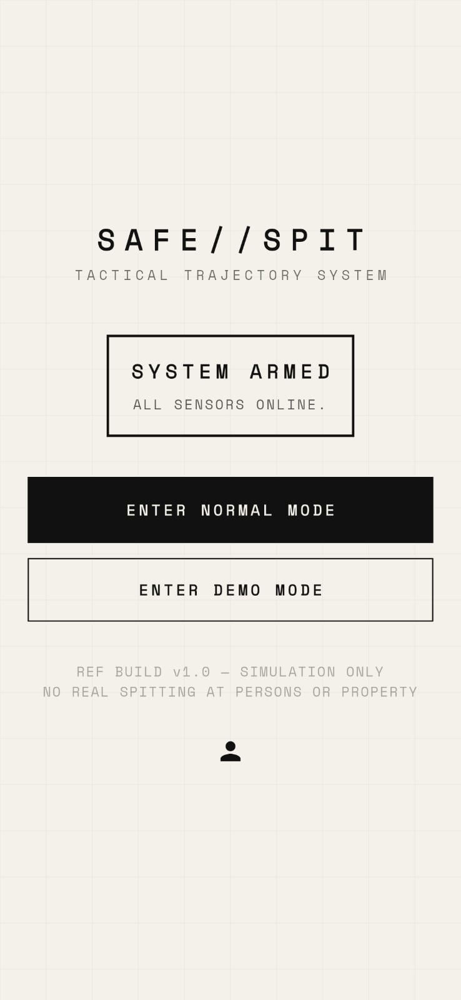
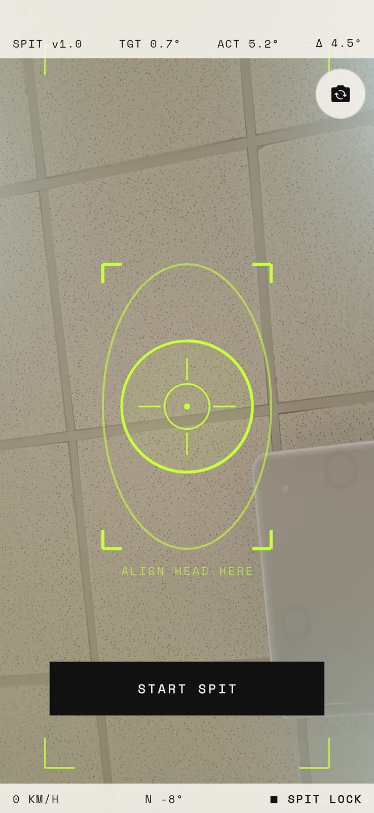
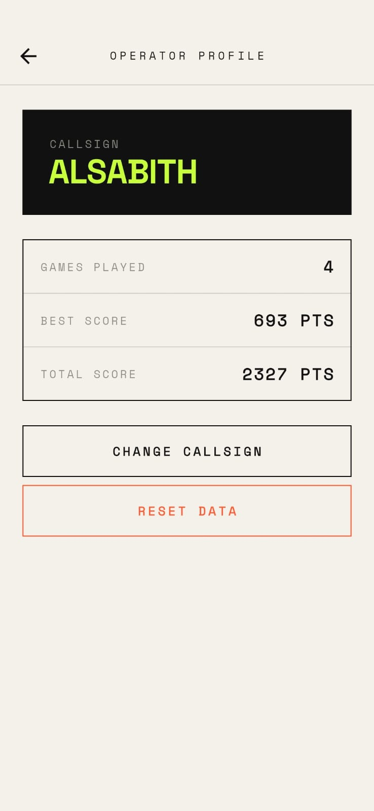

# SAFE//SPIT 🎯

## Basic Details
### Team Name: Minions

### Team Members
- Team Lead: Alsabith KA - College of Engineering Chengannur
- Member 2: Harsh C Hari - College of Engineering Chengannur

### Project Description
SAFE//SPIT is a deliberately over-engineered tactical aerospace instrumentation system for calculating the optimal angle to spit out of a moving vehicle. It fuses real hardware telemetry into a fighter-jet style targeting HUD.

### The Problem (that doesn't exist)
Expectorating from a moving vehicle is an inexact science fraught with fluid blowback, boundary-layer eddy recirculation, and catastrophic aerodynamic miscalculations. Thousands of theoretical drops of saliva are lost daily to the wind due to poor trajectory planning. People simply don't know the mathematically perfect angle to spit such that it curves beautifully in the wind and hits them directly in the face. 

### The Solution (that nobody asked for)
**SAFE//SPIT**: A highly tactical, hardware-driven aerospace HUD that uses your phone's real-time GPS velocity, compass heading, and gyroscope pitch to lock onto the perfect fluid ejection vector. 

Featuring the proprietary **Direct Hit Protocol**, our physics engine inverted standard safety calculations to guarantee that you spit directly onto yourself. Whether you are in a high-speed vehicle or perfectly still (using our new **Vertical Anti-Gravity Calculations**), the app will guide your face to the exact angle required for a catastrophic self-hit. When your phone aligns with the optimal aerodynamic angle, you receive a full "missile-lock" audio/visual/haptic confirmation.

### Features
* **Direct Hit Protocol:** The physics engine ensures you will always find the perfect angle to hit yourself.
* **Vertical Anti-Gravity Calculations:** Stand still or walk and the HUD locks onto 180° for the perfect vertical self-splatter.
* **Fake AR Targeting:** A fully projected impact-point simulation overlaid on the live camera feed, showing exactly where the spit will land in the real world.
* **Personal Mission Log:** Your score history is stored locally — review every failed and successful ejection attempt from the Profile screen.

## Technical Details
### Technologies/Components Used
For Software:
- **Languages used**: Dart
- **Frameworks used**: Flutter
- **Libraries used**: `sensors_plus` (for raw hardware telemetry), `geolocator` (for GPS speed), `audioplayers`, `haptic_feedback`, `camera`, `supabase_flutter`, `provider`.
- **Tools used**: Git, Antigravity IDE, VS Code.

### Implementation
For Software:
# Installation
```bash
# Clone the repository
git clone https://github.com/alsabithka/useless.git

# Enter the application directory
cd useless/app

# Install dependencies
flutter pub get
```

# Run
```bash
# Run on a connected physical device (required for GPS/Gyroscope)
flutter run
```

> **Note:** The app runs fully offline. All scores and profile data are stored locally on-device. No backend or environment variables are required.

### Project Documentation
For Software:

# Screenshots (Add at least 3)

*App dashboard for selecting normal or demo mode.*


*The tactical AR HUD locking onto the optimal trajectory while moving.*


*Profile screen showing the user's personal mission history and scores.*

# Diagrams

*Data pipeline: Hardware Sensors → Sensor Manager (NormalizedTelemetry seam) → Game State (SpitLockController + ChallengeController) → Simulation Engine (Physics + Trajectory + Score). Game State then drives the HUD Screen (AR overlay + Camera) → Result Screen (Score + Grade) → Local Store (SharedPreferences).*

### Project Demo
# Video
[Demo Video — SAFE//SPIT in action](https://drive.google.com/file/d/1ZToiOyaHkLRw0d3NiWRcLRGSrMBpRSKB/view?usp=drivesdk)
*A real-world test demonstrating the transition from SEARCHING to SPIT LOCK using live vehicular speed and pitch matching.*

# Additional Demos
[Live website → https://alsabithka.github.io/useless/]

## Team Contributions
- Alsabith KA: Flutter HUD design, custom painter logic, core UI mechanics, Supabase integration & anonymous auth, website frontend.
- Harsh C Hari: Hardware telemetry integration, GPS speed mapping, gyroscope normalization, deterministic ballistic physics modelling.
